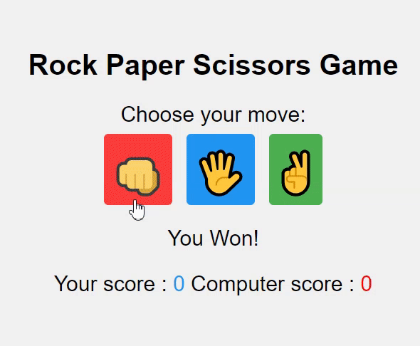

# Rock-Paper-Scissors-Game



## 기능  

컴퓨터와 가위바위보 게임  

(1) 사용자가 가위 바위 보 버튼 중 클릭   
(2) 컴퓨터와 게임을 해서 승패가 결정  
(3) score 점수가 올라감  

## 학습  

### JS : innerHtml vs innerText vs textContent  
**innerHtml**    
모든 공백 및 내부 HTML 태그를 포함한 요소의 텍스트 콘텐츠를 반환  

**innerText**  
`<script>` 및 `<style>` 요소를 제외하고 CSS 숨겨진 텍스트 공백 및 태그 없이 요소와 모든 하위 요소의 텍스트 콘텐츠만 반환

**textContent**      
공백과 CSS 숨겨진 텍스트는 있지만 태그는 없는 요소와 모든 하위 항목의 텍스트 콘텐츠를 반환  

```
<p id="myP">   This element has extra spacing   and contains <span>a span element</span>.</p>

<button onclick="getinnerHTML()">Get innerHTML</button>
<button onclick="getinnerText()">Get innerText</button>
<button onclick="gettextContent()">Get textContent</button>

<pre id="demo"></pre>

// getinnerText
// This element has extra spacing   and contains <span>a span element</span>.

// getinnerHTML
// This element has extra spacing and contains a span element.

// gettextContent
//    This element has extra spacing   and contains a span element.

```
```
<script>
function getinnerText() {
  let text = document.getElementById("myP").innerText;
  document.getElementById("demo").innerText = text;
}

function getinnerHTML() {
  let text = document.getElementById("myP").innerHTML;
  document.getElementById("demo").innerText = text;
}

function gettextContent() {
  let text = document.getElementById("myP").textContent;
  document.getElementById("demo").innerText = text;
}
</script>
```


## 학습 출처 
**유니코드 사이트**  
https://compart.com/en/unicode

**유튜브**  
https://www.youtube.com/@JavaScriptKing   

**JS**  
https://www.w3schools.com/jsref/prop_html_innerhtml.asp

**키워드**   
- innerHtml
- innerText
- textContent  


